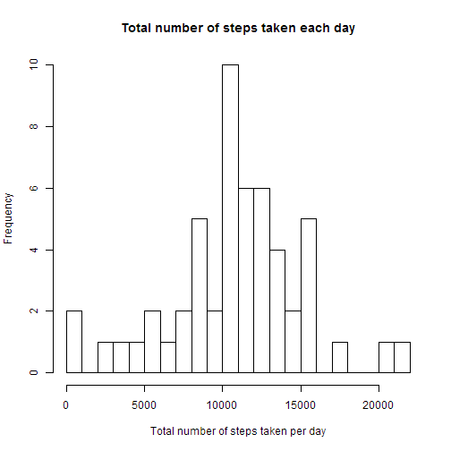
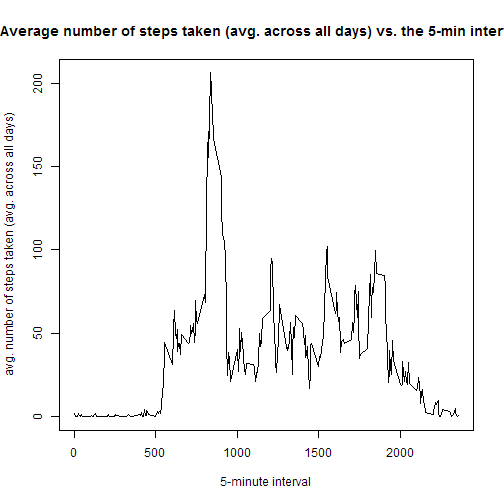
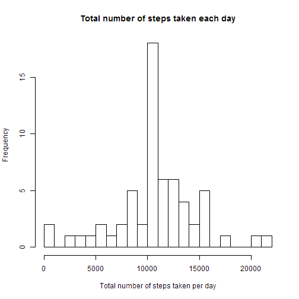
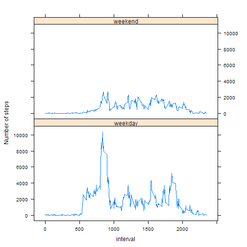

This is an report answering the questions for Assignment #1 in the Reproducible Research course.


####Loading and preprocessing the data


```r
#Load the data
activity<-read.csv("C:\\Coursera\\data_science\\reproducible_research\\assignment\\assignment1\\repdata-data-activity\\activity.csv", header =T)

#Process/transform the data into suitable format for analysis
if (!require(plyr)) install.packages('plyr'); require(plyr)
steps<-ddply(activity, c("date"), summarise, 
            tot.steps<-sum(steps),
            mean.steps<-mean(steps,na.rm = T),
            med.steps<-median(steps,na.rm = T))
names(steps)<-c("date", "tot.steps", "mean.steps", "med.steps")
```

####What is the total number of steps taken per day?


```r
#Make a histogram of the total number of steps taken each day
hist(steps$tot.steps, breaks = seq(0,22000, 1000), xlim = c(0,22000), xlab = "Total number of steps taken per day", main = "Total number of steps taken each day")
```

 

```r
#Calculate and report the mean and median total numbers of steps taken per day
mean.tot.steps<-mean(steps$tot.steps, na.rm = T)
median.tot.steps<-median(steps$tot.steps, na.rm = T)     
```

The mean total number of steps taken per day is 1.0766 &times; 10<sup>4</sup> and the median is 10765.

####What is the average daily activity pattern?

```r
act.pattern<-ddply(activity,c("interval"), summarise, mean(steps,na.rm=T))
names(act.pattern)<-c("interval", "avg.steps")
#make time series plot
plot(act.pattern, type = "l", ylab = "avg. number of steps taken (avg. across all days)", xlab = "5-minute interval", main = "Average number of steps taken (avg. across all days) vs. the 5-min intervals")
```

 

```r
#which 5-minute interval, on average across all the days in the dataset, contains the max number of steps

max.int<- act.pattern[act.pattern$avg.steps ==max(act.pattern$avg.steps),]
```

The 5-minute interval, on average across all the days in the dataset, 835 contains the maximum number of steps (206 steps).

#### Imputing missing values

```r
#Calculate and report the total number of missing values in the dataset
md<-activity[!complete.cases(activity),]
```
The total number of rows missing values in the activity dataset are 2304.

```r
activity2=activity
#Devise a strategy for filling in all of the missing values in the dataset. The strategy does not need to be sophisticated. For example, you could use the mean/median for that day, or the mean for that 5-minute interval, etc.

#Create a new dataset that is equal to the original dataset but with the missing data filled in.
for(i in 1:nrow(activity)){
  if(is.na(activity2$steps[i])){activity2$steps[i]<-act.pattern$avg.steps[activity2$interval[i]==act.pattern$interval]}
}

steps2<-ddply(activity2, c("date"), summarise, 
            tot.steps<-sum(steps),
            mean.steps<-mean(steps,na.rm = T),
            med.steps<-median(steps,na.rm = T))
names(steps2)<-c("date", "tot.steps", "mean.steps", "med.steps")
```

The missing data was replaced by taking the average 5-minute interval value.


```r
#Make a histogram of the total number of steps taken each day after missing data was imputed
hist(steps2$tot.steps, breaks = seq(0,22000, 1000), xlim = c(0,22000), xlab = "Total number of steps taken per day", main = "Total number of steps taken each day")
```

 

```r
#Calculate and report the mean and median total numbers of steps taken per day
mean.tot.steps2<-mean(steps2$tot.steps, na.rm = T)
median.tot.steps2<-median(steps2$tot.steps, na.rm = T)     
```


The mean total number of steps taken per day is 1.0766 &times; 10<sup>4</sup> and the median is 1.0766 &times; 10<sup>4</sup>.  The median value is only off by one from the original data sets median value.


#### Are there differences in activity patterns between weekdays and weekends?

```r
#Create a new factor variable in the dataset with two levels - "weekday" and "weekend"
activity2$date2<-as.Date(activity2$date, "%Y-%m-%d")
activity2$week<-as.character(weekdays(activity2$date2, abbreviate = T))

activity2$week2<-"weekday"
activity2$week2[activity2$week== "Sun"]<-"weekend"
activity2$week2[activity2$week== "Sat"]<-"weekend"

if (!require(lattice)) install.packages('lattice'); require(lattice)
steps3<-ddply(activity2, c("interval","week2"), summarise, 
            tot.steps<-sum(steps))
names(steps3)<-c("interval", "week2", "steps")

#Make a panel plot containing a time series plot (i.e. type = "l") of the 5-minute interval (x-axis) and the average number of steps taken, averaged across all weekday days or weekend days (y-axis).
xyplot(steps~interval|week2, data = steps3, type = "l", layout = c(1,2), ylab="Number of steps")
```

 


